# نظام سكرات لإدارة علاقات المتبرعين (SokratCRM)

<div align="center">

**نظام CRM متكامل وحديث لإدارة عمليات الجمعيات والمؤسسات الخيرية**

منظومة متطورة مبنية على إطار العمل Laravel 13 مخصصة للمؤسسات الخيرية وغير الربحية. توفر حلولاً شاملة لمتابعة دورة حياة المتبرعين، خطوط سير المتابعات، تنظيم التحصيلات الميدانية، إدارة الحملات الخيرية، إدارة الفروع، وإرسال التنبيهات عبر قنوات متعددة ضمن بيئة برمجية آمنة وعالية الأداء.

[](https://laravel.com)
[](https://php.net)
[](https://mysql.com)
[](tests/)
[](tests/)
[](LICENSE)

[**English**](README.md) • [**العربية**](README.ar.md)

</div>

---

## 📸 نظرة عامة ولوحة التحكم

<div align="center">
  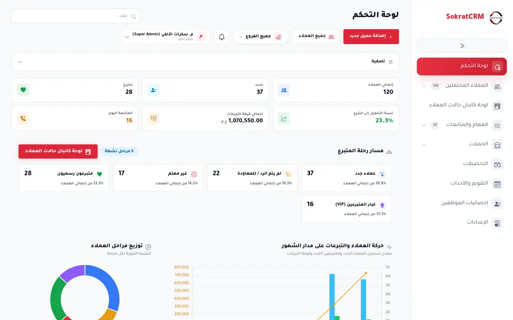
  <p><em>لوحة التحكم التنفيذية: مؤشرات الأداء الحية، رحلة المتبرع، إحصائيات التبرعات الشهرية، نسب التحويل، وتوزيع الفروع.</em></p>
</div>

---

## 📑 الفهرس

- [المميزات الرئيسية](#-المميزات-الرئيسية)
- [معرض شاشات النظام](#-معرض-شاشات-النظام)
- [مخطط دورة التبرع والمتابعة](#-مخطط-دورة-التبرع-والمتابعة)
- [الأمان ونظام الصلاحيات](#-الأمان-ونظام-الصلاحيات)
- [نموذج المجموعات والأدوار](#-نموذج-المجموعات-والأدوار)
- [البنية المعمارية للنظام](#-البنية-المعمارية-للنظام)
- [التقنيات المستخدمة](#-التقنيات-المستخدمة)
- [التثبيت والتشغيل السريع](#-التثبيت-والتشغيل-السريع)
- [إعداد المهام المجدولة والخلفية](#-إعداد-المهام-المجدولة-والخلفية)
- [الاختبارات وضمان الجودة](#-الاختبارات-وضمان-الجودة)
- [هيكل المشروع البرمجي](#-هيكل-المشروع-البرمجي)
- [سياسة الأمان والمساهمة](#-سياسة-الأمان-والمساهمة)
- [الترخيص](#-الترخيص)

---

## 🌟 المميزات الرئيسية

### 🤝 إدارة المتبرعين والعملاء المحتملين
- **ملف متكامل للمتبرع:** سجل شامل لبيانات التواصل، تاريخ التبرعات، تفضيلات التواصل، وملاحظات المتابعة.
- **لوحة كانبان تفاعلية:** متابعة حركة المتبرعين بين المراحل مع إمكانية السحب والإفلات أو التحويل السريع عبر الأزرار.
- **مراحل مخصصة وأسئلة المراحل:** إمكانية تخصيص مراحل خط السير وربط كل مرحلة بنماذج أسئلة مخصصة وحقول إجبارية.
- **سجل المتابعات الموحد:** تسجيل زمني دقيق لكل مكالمة، زيارة، محادثة واتساب، أو مهمة مع ربطها بالموظف المسؤول.
- **استيراد وتصدير البيانات:** دعم استيراد وتصدير ملفات Excel/CSV مع التحقق المسبق من صحة البيانات وتعيين الموظفين والفروع.

### 💰 إدارة التبرعات وطرق الدفع
- **تتبع دورات التبرع:** إدارة التبرعات الفردية والدورية (شهري، ربع سنوي، سنوي).
- **طرق تبرع متعددة:** دعم الدفع النقدي، التحويلات البنكية، المحافظ الإلكترونية (فودافون كاش، إنستاباي)، الشيكات، وبوابات الدفع الفوري.
- **إيصالات التبرع:** إمكانية إرفاق ومراجعة صور إيصالات الدفع والتحصيل.
- **ترقية تلقائية لرحلة المتبرع:** تحويل العميل المحتمل تلقائياً إلى "متبرع رسمي" أو "كبار المتبرعين (VIP)" فور تأكيد التبرع.

### 🚚 التحصيلات الميدانية وتوزيع المحصلين
- **إسناد وتوزيع الحالات:** إسناد حالات جمع التبرعات الميدانية إلى المحصلين حسب الفرع والمنطقة.
- **متابعة حالات التحصيل:** تتبع الحالات عبر دورة واضحة: `قيد الانتظار`، `مسندة`، `مجدولة`، `تم التحصيل`، `فشلت`، و`ملغاة`.
- **إعادة الجدولة وتوثيق الأسباب:** إمكانية إعادة جدولة موعد التحصيل مع تسجيل أسباب التأجيل وتحديث التقويم تلقائياً.
- **عزل بيانات المحصلين:** يقتصر وصول المحصل على الحالات المسندة إليه شخصياً فقط.

### 📢 إدارة الحملات الخيرية
- **حملات موجهة ومجدولة:** إنشاء ومتابعة الحملات الإغاثية والموسمية مع تحديد الميزانيات المستهدفة وفرق العمل.
- **توزيع المتبرعين على الحملات:** توزيع المتبرعين على فريق الحملة يدوياً أو بنسب متوازية.
- **تقارير الإنجاز والعائد:** مؤشرات حية لمعدلات الاستجابة، نسب التحويل، وإجمالي التبرعات المحصلة لكل حملة.

### 📅 المهام اليومية والتقويم الموحد
- **مركز المهام والمتابعات اليومية:** واجهة عمل مخصصة تنظم المتابعات إلى: *المتأخرة*، *اليوم*، *القادمة*، و*بدون موعد*.
- **تقويم تشغيلي متعدد الفروع:** تقويم تفاعلي مع دعم الاشتراك وتصدير ملفات iCal للمزامنة مع تقويم Google وApple.
- **تواصل فوري:** اتصال هاتفي مباشر عبر السنترال (VoIP) ومحادثات واتساب بضغطة زر.

### 🔔 محرك التنبيهات وقواعد التصعيد
- **تنبيهات عبر قنوات متعددة:** داخل النظام، إشعارات المتصفح (Web Push - VAPID)، البريد الإلكتروني، رسائل SMS، والواتساب.
- **قواعد تنبيه آلية:** مشغلات تلقائية للتذكير بالمواعيد القريبة، المتابعات المتأخرة، وإشعارات التحصيل.
- **عزل كامل للتنبيهات:** حماية خصوصية المستخدمين وتوجيه التنبيهات فقط للمستفيدين المعنيين بالفرع والحدث.

### 🏢 تعدد الفروع والصلاحيات الدقيقة
- **عزل كامل لبيانات الفروع:** بنية تحتية تضمن عمل كل فرع باستقلالية مع نطاق بيانات محمي.
- **أكثر من 55 صلاحية دقيقة:** مصفوفة صلاحيات تفصيلية موزعة على 5 مجموعات تشغيلية واضحة.
- **تخصيص كامل لواجهة المستخدم:** تعديل حقول النماذج، خيارات القوائم، وتفضيلات النظام دون الحاجة لكتابة كود برمجي.

---

## 🖼️ معرض شاشات النظام

### لوحة كانبان المتبرعين
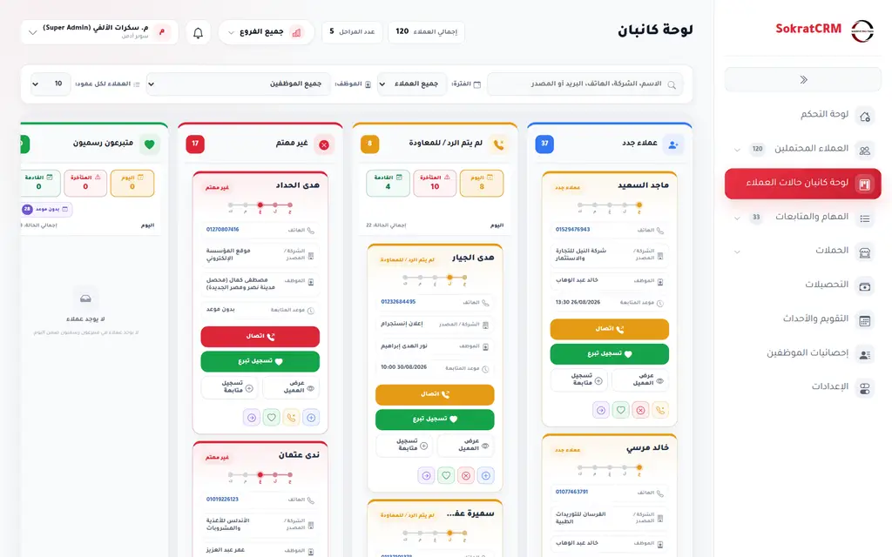

---

### ملف المتبرع وسجل المتابعات
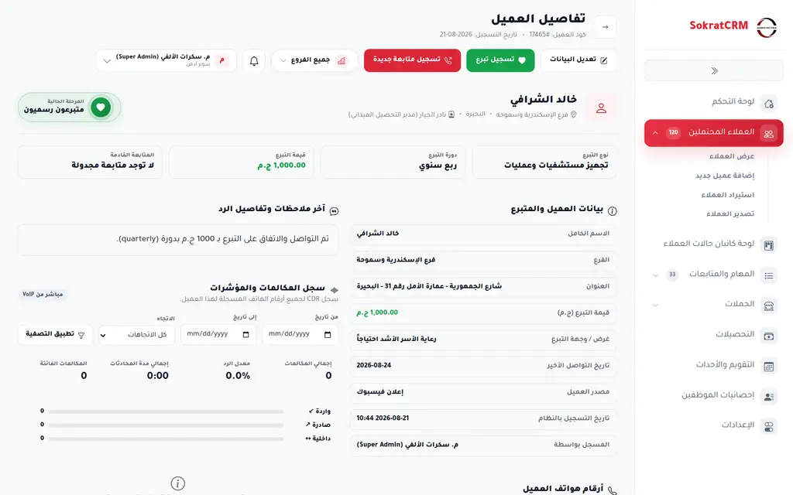

---

### إدارة التحصيلات الميدانية
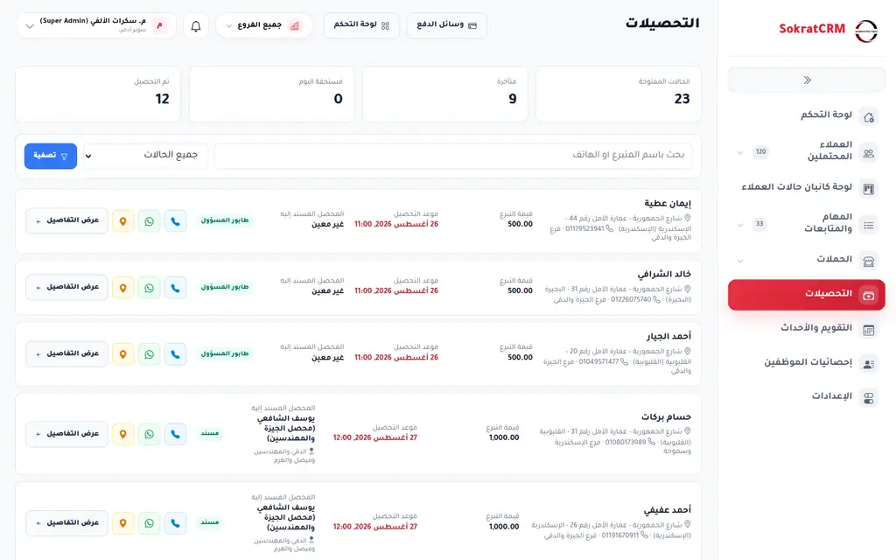

---

### إدارة الحملات الخيرية
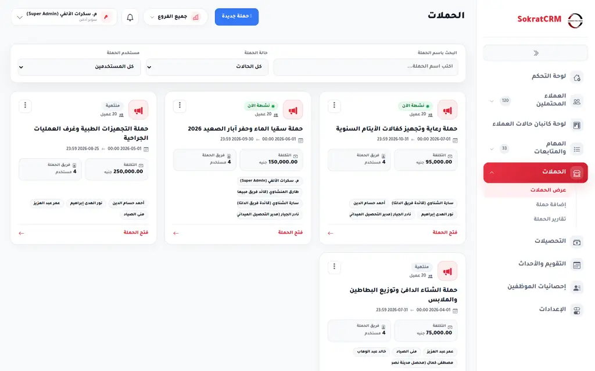

---

### التقويم الموحد والمواعيد
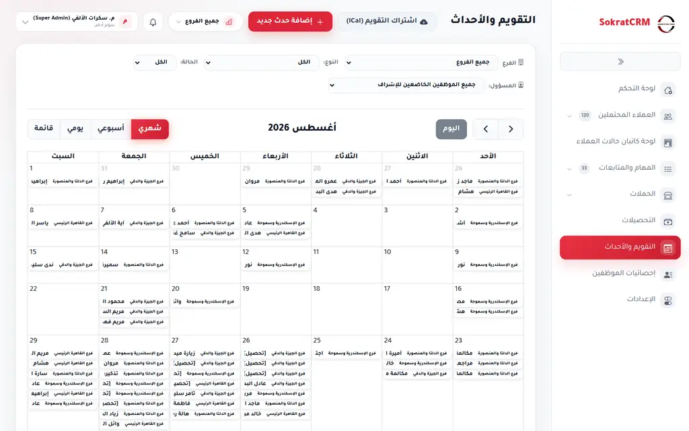

---

### المهام اليومية والمتابعات
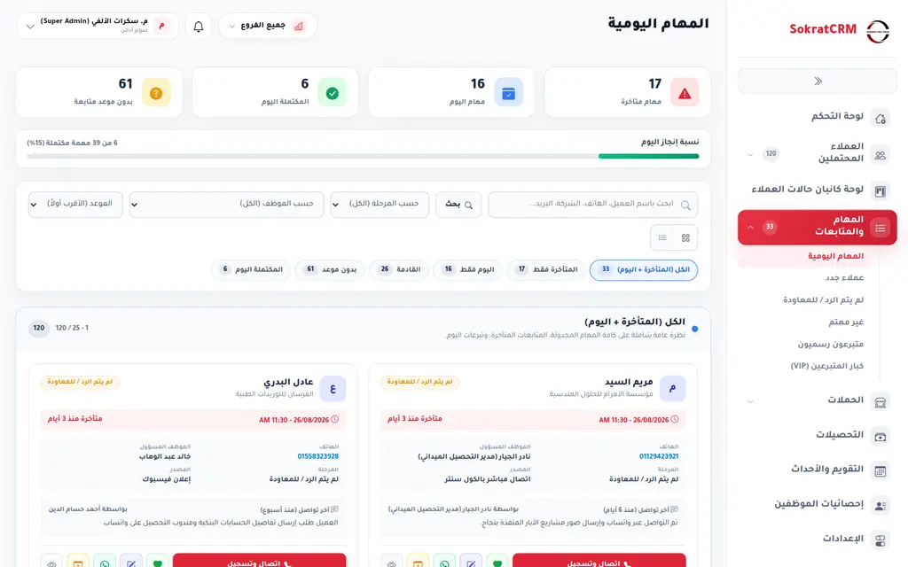

---

### قواعد التنبيهات وقنوات الإرسال
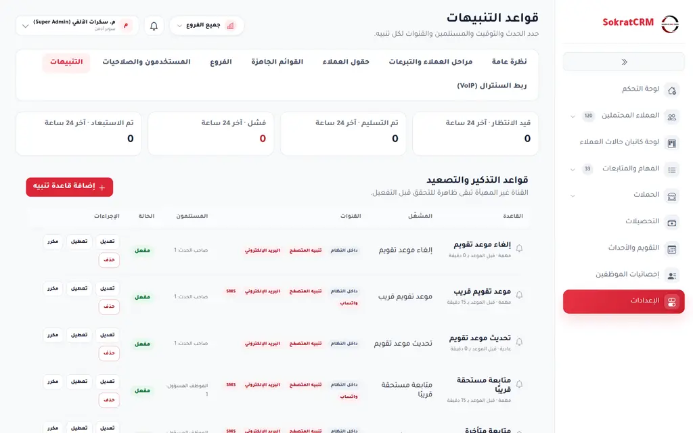

---

### مصفوفة الصلاحيات والمجموعات (RBAC)
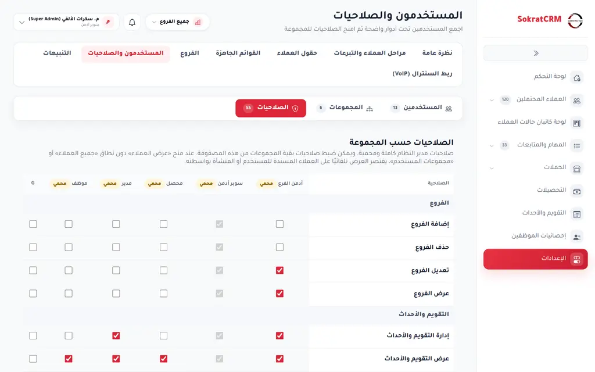

---

## 🔄 مخطط دورة التبرع والمتابعة

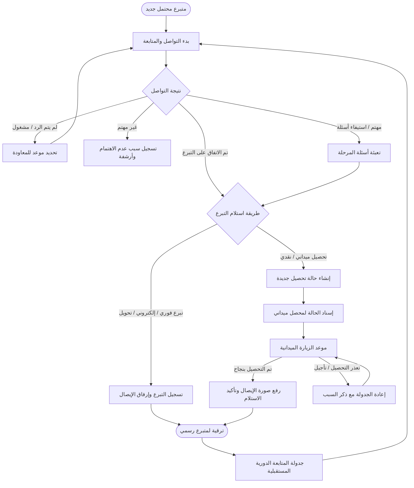

---

## 🔒 الأمان ونظام الصلاحيات

- **مصفوفة الصلاحيات الدقيقة (`CrmPermission`):** أكثر من 55 صلاحية مستقلة تضمن التحكم الكامل في الروابط، العمليات، والأزرار.
- **عزل بيانات الفروع:** تطبيق نطاقات استعلام تلقائية تمنع وصول موظفي الفروع لبيانات فروع أخرى.
- **حماية شاملة ضد ثغرات IDOR:** التحقق الصارم من سياسات الوصول (Laravel Policies) قبل أي عملية تعديل أو حذف.
- **عزل التنبيهات:** خوارزميات توجيه تمنع تسرب الإشعارات لغير أصحاب الصلاحية.
- **اختبارات أمنية مؤتمتة:** تغطية اختبارات شاملة تتحقق من صلابة الأمان وحواجز الوصول.

---

## 👥 نموذج المجموعات والأدوار

| كود المجموعة | المسمى الوظيفي | المهام الرئيسية | نطاق الوصول |
| :--- | :--- | :--- | :--- |
| `super-admin` | **سوبر أدمن** | وصول شامل ومحمي لجميع وظائف النظام، الإعدادات، الفروع، والتقارير. | على مستوى المؤسسة بالكامل |
| `branch-admin` | **أدمن الفرع** | إدارة عمليات الفرع، الموظفين، المتابعات، والتحصيلات التابعة لفرعه. | الفرع المسند إليه فقط |
| `manager` | **مدير** | الإشراف على فرق العمل، توزيع المتبرعين، متابعة الحملات والتحصيلات. | فرق العمل / الفرع |
| `collector` | **محصل ميداني** | تنفيذ حالات التحصيل المسندة إليه، تسجيل الإيصالات، وإعادة الجدولة. | الحالات المسندة إليه فقط |
| `employee` | **موظف / مسؤول متابعة** | التعامل اليومي مع المتبرعين، تسجيل المتابعات، واستيفاء نماذج المراحل. | المتبرعون المسندون / الفرع |

---

## 🏛️ البنية المعمارية للنظام

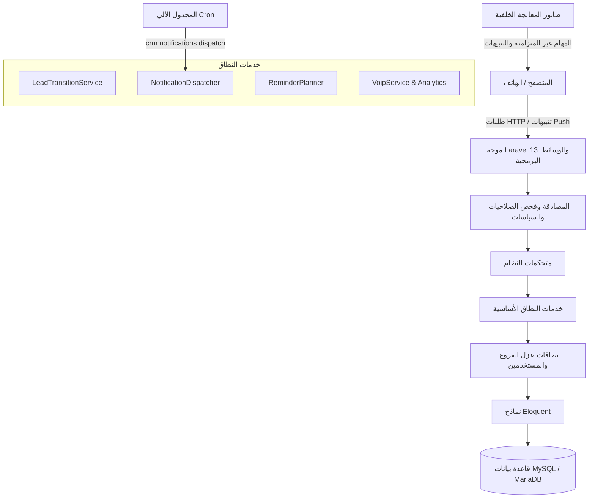

---

## 💻 التقنيات المستخدمة

- **الواجهة الخلفية:** Laravel 13.x مع PHP ^8.3
- **قاعدة البيانات:** MySQL 8.0+ / MariaDB
- **الواجهة الأمامية:** Blade Views, Tailwind CSS 4.x, JavaScript (ES Modules), Vite 8.x, Chart.js
- **التنبيهات الفورية:** Web Push (VAPID Standard) عبر `minishlink/web-push`
- **بيئة الاختبارات:** PHPUnit 12.x

---

## 🚀 التثبيت والتشغيل السريع

### المتطلبات الأساسية
- PHP 8.3+ مع الإضافات القياسية
- MySQL 8.0+ أو MariaDB 10.4+
- Composer 2.x
- Node.js 18+ و npm

### الطريقة الأولى: التثبيت الآلي على Ubuntu 24.04

```bash
curl -sSL https://raw.githubusercontent.com/moayed33/SokratCRM-v3/main/install.sh | sudo bash
```

---

### الطريقة الثانية: التثبيت اليدوي

1. **استنساخ المستودع:**
   ```bash
   git clone https://github.com/moayed33/SokratCRM-v3.git
   cd SokratCRM-v3
   ```

2. **تثبيت الاعتماديات:**
   ```bash
   composer install
   npm install
   ```

3. **إعداد ملف البيئة:**
   ```bash
   cp .env.example .env
   php artisan key:generate
   ```

4. **ترحيل قاعدة البيانات وإنشاء البيانات الأولية:**
   ```bash
   php artisan migrate --seed
   php artisan storage:link
   ```

5. **بناء ملفات الواجهة:**
   ```bash
   npm run build
   ```

6. **تشغيل الخادم المحلي:**
   ```bash
   php artisan serve
   ```

---

## ⚙️ إعداد المهام المجدولة والخلفية

### 1. مجدول المهام (Scheduler)
أضف السطر التالي لملف `crontab` على الخادم:
```crontab
* * * * * cd /var/www/html/crm-v3 && php artisan schedule:run >> /dev/null 2>&1
```

### 2. تشغيل عامل طابور المهام (Queue Worker)
```bash
php artisan queue:work --tries=3
```

---

## 🧪 الاختبارات وضمان الجودة

```bash
./vendor/bin/phpunit
```

### نتائج الاختبارات المعتمدة للإصدار:
```text
Tests:       388 passed (388 total)
Assertions:  2269 assertions verified
Errors:      0
Failures:    0
Status:      PASSED
```

---

## 🤝 سياسة الأمان والمساهمة

- **الإبلاغ عن الثغرات الأمنية:** يرجى قراءة [SECURITY.md](SECURITY.md).
- **إرشادات المساهمة في التطوير:** يرجى الاطلاع على [CONTRIBUTING.md](CONTRIBUTING.md).

---

## 📄 الترخيص

نظام SokratCRM مرخص بموجب ترخيص [MIT License](LICENSE).
