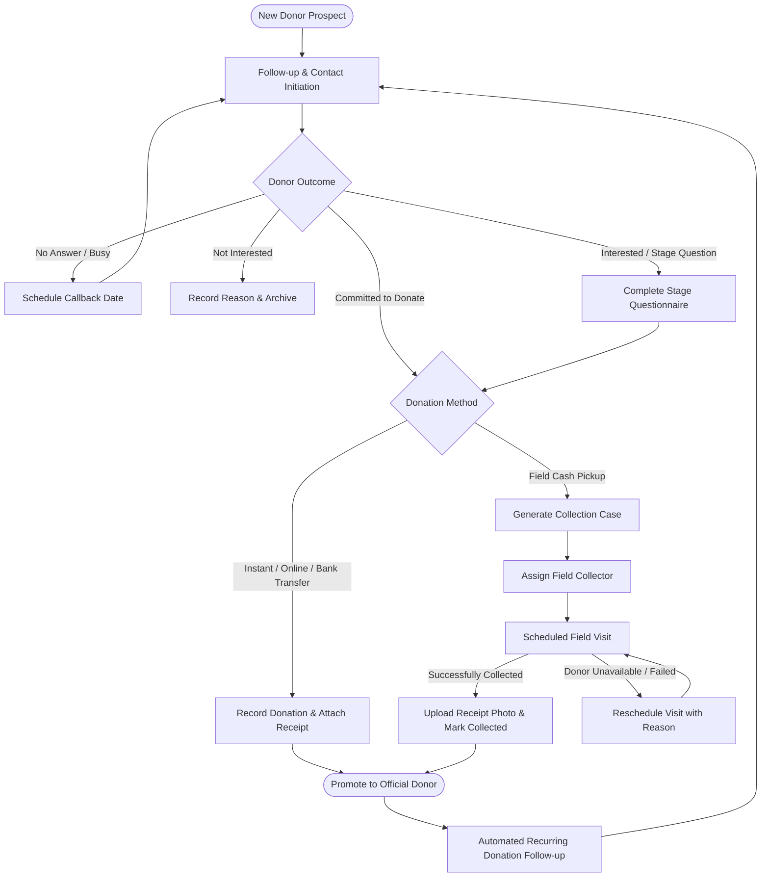
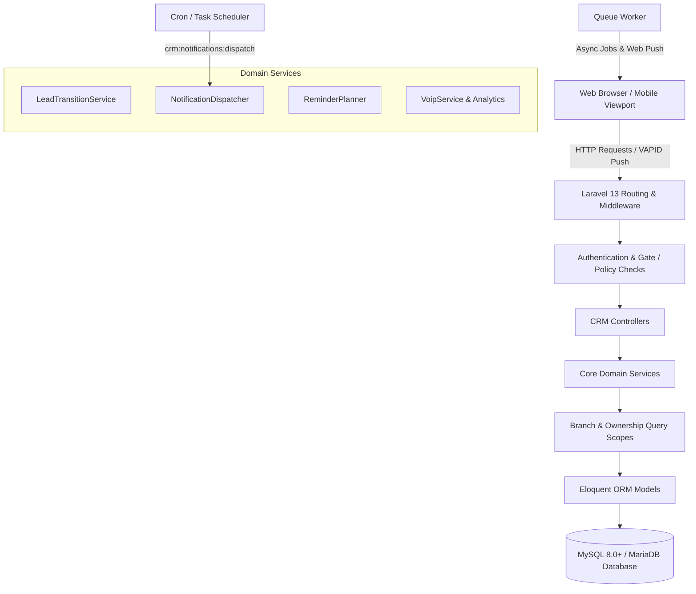

# SokratCRM

<div align="center">

**Modern CRM for Donor & Charity Operations**

A high-performance Laravel CRM purpose-built for charitable organizations, non-profits, and fundraising teams. Streamline donor relationships, multi-stage pipelines, follow-up scheduling, field collection operations, charity campaigns, multi-branch administration, and multi-channel notification workflows in one unified, secure platform.

[](https://laravel.com)
[](https://php.net)
[](https://mysql.com)
[](tests/)
[](tests/)
[](LICENSE)

[**English**](README.md) • [**العربية**](README.ar.md)

</div>

---

> **نظام متكامل لإدارة علاقات المتبرعين، الحملات الخيرية، المتابعات الميدانية والهاتفية، دورات التبرع، التحصيلات، فرق العمل، وتعدد الفروع للمؤسسات والجمعيات الخيرية.**

---

## 📸 Overview & Dashboard

<div align="center">
  
  <p><em>Executive Dashboard: Real-time donor journey KPIs, monthly donation trends, pipeline conversion rates, and branch metrics.</em></p>
</div>

---

## 📑 Table of Contents

- [Core Features](#-core-features)
- [Product Screenshot Gallery](#-product-screenshot-gallery)
- [Charity & Donation Workflow](#-charity--donation-workflow)
- [Security & Authorization Architecture](#-security--authorization-architecture)
- [Role & Group Model](#-role--group-model)
- [System Architecture](#-system-architecture)
- [Technology Stack](#-technology-stack)
- [Installation & Quick Start](#-installation--quick-start)
- [Configuration & Background Services](#-configuration--background-services)
- [Testing & Quality Assurance](#-testing--quality-assurance)
- [Project Directory Structure](#-project-directory-structure)
- [Deployment Considerations](#-deployment-considerations)
- [Contributing & Security Policies](#-contributing--security-policies)
- [License](#-license)

---

## 🌟 Core Features

### 🤝 Donor & Lead Management
- **Centralized Donor Profiles:** Complete donor history, donation logs, contact records, communication preferences, and custom dynamic attributes.
- **Interactive Kanban Board:** Visual pipeline management with drag-and-drop transitions and quick transition action buttons.
- **Dynamic Pipeline Stages:** Customizable pipeline stages with stage-specific questionnaires, custom field validation, and transition logic.
- **Unified Follow-up Timeline:** Comprehensive chronological logs of every call, visit, WhatsApp exchange, and notes with attribution to responsible agents.
- **Data Import & Export:** Validated CSV/Excel import with preview mapping; secure filtered export capabilities.

### 💰 Donation Management & Payment Methods
- **Comprehensive Donation Tracking:** Support for one-time gifts and recurring donation cycles (monthly, quarterly, annual).
- **Flexible Donation Methods:** Out-of-the-box support for Cash, Bank Transfer, Mobile Wallets (Vodafone Cash, InstaPay), Cheques, and Instant Donation Gateways.
- **Receipt & Proof Uploads:** Mandatory or optional receipt attachment verification with image preview and download support.
- **Donor Journey Analytics:** Automated transition of prospects to verified active donors upon successful donation confirmation.

### 🚚 Field Collections & Dispatch Operations
- **Collection Case Dispatch:** Automatic and manual assignment of scheduled donation pickups to field collectors.
- **Operational Statuses:** End-to-end tracking through `Pending`, `Assigned`, `Scheduled`, `Collected`, `Failed`, and `Cancelled` states.
- **Field Visit Rescheduling:** Reschedule collection appointments with reason tracking and automated calendar updates.
- **Receipt Confirmation:** Mobile-friendly proof-of-collection upload workflow for field agents.
- **Collector Scoping:** Strict isolation ensuring collectors only view and manage cases explicitly assigned to them.

### 📢 Charity Campaigns
- **Targeted Campaign Management:** Create and track fundraising campaigns with budget targets, timeframes, and dedicated working teams.
- **Lead & Donor Member Allocation:** Distribute donor pools evenly or selectively across campaign team members.
- **Conversion & Financial Reporting:** Real-time analytics on contact rates, donation conversion ratios, and total funds raised per campaign.

### 📅 Daily Operations & Calendar
- **Daily Tasks Queue:** Dedicated operational workspace organizing tasks into *Overdue*, *Today*, *Upcoming*, and *Unscheduled* queues.
- **Integrated Calendar:** Multi-branch operational calendar with iCal subscription support for external calendar synchronization (Google Calendar, Apple Calendar, Outlook).
- **One-Click Communication:** Direct call triggers, VoIP PBX integration, and one-click WhatsApp web/app chat initiators.

### 🔔 Multi-Channel Notification Engine
- **Multi-Channel Delivery:** In-App notifications, Web Push notifications (VAPID standard), Email, SMS, and WhatsApp alerts.
- **Automated Rule Engine:** Configurable triggers for upcoming appointments, overdue follow-ups, collection reminders, and stage escalations.
- **User Notification Isolation:** Strict privacy barrier ensuring team members only receive alerts relevant to their scope and branch.

### 🏢 Multi-Branch & Granular Administration
- **Branch Data Isolation:** Scoped data architecture guaranteeing that branches manage their respective donors and staff independently.
- **Granular Permissions:** 55+ discrete system permissions mapped across 5 operational groups for fine-grained access control.
- **Dynamic GUI Customization:** Modify lead form fields, pipeline stages, option sets, and system preferences without code changes.

---

## 🖼️ Product Screenshot Gallery

### Donor Kanban Board

<p><em>Visual Kanban pipeline displaying donor progression stages with quick-transition dialogs.</em></p>

---

### Donor Profile & Follow-up History

<p><em>Comprehensive donor card with contact details, donation history, and interactive follow-up timelines.</em></p>

---

### Field Collections Operations

<p><em>Field collection management showing case statuses, assigned collectors, donation amounts, and receipt status.</em></p>

---

### Charity Campaign Management

<p><em>Campaign overview cards showing active fundraising projects, assigned teams, target budgets, and lead allocations.</em></p>

---

### Operational Calendar & Events

<p><em>Unified calendar featuring branch filters, event scheduling, and iCal feed subscription integration.</em></p>

---

### Daily Tasks & Follow-up Center

<p><em>Daily operational task manager organizing urgent follow-ups, callbacks, and completion rates.</em></p>

---

### Notification & Escalation Rules

<p><em>Multi-channel notification management with channel toggles for In-App, Web Push, SMS, WhatsApp, and Email.</em></p>

---

### Role-Based Access Control (RBAC) Matrix

<p><em>Fine-grained permissions matrix governing access across all CRM modules and operational groups.</em></p>

---

## 🔄 Charity & Donation Workflow

The diagram below illustrates the typical lifecycle of a donor relationship within SokratCRM:



---

## 🔒 Security & Authorization Architecture

SokratCRM is built with a defensive security mindset to protect sensitive donor records, financial transactions, and organizational workflows:

- **Granular Permission Enum (`CrmPermission`):** Over 55 discrete permissions govern route execution, controller actions, and UI element rendering.
- **Strict Multi-Branch Isolation:** Global and model query scopes ensure that branch staff cannot access or tamper with data belonging to other branches.
- **IDOR (Insecure Direct Object Reference) Protection:** Route model bindings and authorization policies validate ownership before executing any update or delete action.
- **User-Scoped Notification Delivery:** Notification recipient resolution algorithms ensure alerts are strictly directed to authorized stakeholders.
- **Collection Access Policy:** Field collectors are constrained to their explicitly assigned collection cases.
- **Automated Security Test Suite:** Robust test coverage verifying authentication barriers, group privileges, and tamper-resistance.

---

## 👥 Role & Group Model

SokratCRM provides 5 standardized operational groups designed for charity operations:

| Group Code | Role Name | Primary Responsibilities | Scope Level |
| :--- | :--- | :--- | :--- |
| `super-admin` | **Super Admin** | Full, unrestricted access across all system settings, branches, reports, and data. | Organization-wide |
| `branch-admin` | **Branch Admin** | Full operational administration, user management, and reporting within their branch. | Assigned Branch |
| `manager` | **Manager** | Supervision of assigned teams, lead allocation, campaign monitoring, and collection review. | Supervised Teams / Branch |
| `collector` | **Field Collector** | Execution of assigned field collection cases, receipt capture, and visit rescheduling. | Assigned Cases Only |
| `employee` | **Employee / Agent** | Daily donor follow-ups, questionnaire completion, pipeline advancement, and tasks. | Assigned Donors / Branch |

> *Note: Authorization is enforced via granular underlying permissions. Groups serve as manageable permission templates.*

---

## 🏛️ System Architecture



---

## 💻 Technology Stack

### Backend
- **Framework:** Laravel 13.x
- **Language:** PHP ^8.3 (Requires: `cli`, `mysql`, `mbstring`, `xml`, `curl`, `zip`, `bcmath`, `intl`, `gd`, `gmp`)
- **Database:** MySQL 8.0+ / MariaDB
- **Push Services:** `minishlink/web-push` (^11.0) for standard VAPID Web Push

### Frontend
- **Templating:** Blade Server-Rendered Views
- **CSS Architecture:** Tailwind CSS 4.x
- **Build Tool:** Vite 8.x (`laravel-vite-plugin`)
- **Charts & Visualization:** Chart.js

### Testing & Quality
- **Test Runner:** PHPUnit 12.x
- **Code Standards:** Laravel Pint

---

## 🚀 Installation & Quick Start

### Prerequisites
- PHP 8.3 or higher with standard extensions
- MySQL 8.0+ or MariaDB 10.4+
- Composer 2.x
- Node.js 18+ & npm

### Method 1: Ubuntu 24.04 Automated Installer

For fresh Ubuntu 24.04 LTS installations:

```bash
curl -sSL https://raw.githubusercontent.com/moayed33/SokratCRM-v3/main/install.sh | sudo bash
```

---

### Method 2: Manual Setup

1. **Clone the Repository:**
   ```bash
   git clone https://github.com/moayed33/SokratCRM-v3.git
   cd SokratCRM-v3
   ```

2. **Install Dependencies:**
   ```bash
   composer install
   npm install
   ```

3. **Configure Environment:**
   ```bash
   cp .env.example .env
   php artisan key:generate
   ```
   *Edit `.env` to configure your database connection parameters (`DB_DATABASE`, `DB_USERNAME`, `DB_PASSWORD`).*

4. **Run Database Migrations & Seeders:**
   ```bash
   php artisan migrate --seed
   php artisan storage:link
   ```

5. **Build Frontend Assets:**
   ```bash
   npm run build
   ```

6. **Start Development Server:**
   ```bash
   php artisan serve
   ```
   Navigate to `http://localhost:8000` in your web browser.

---

## ⚙️ Configuration & Background Services

### 1. Notification Scheduler
SokratCRM schedules automatic notification dispatches, reminder planning, and escalation checks every minute.

Add the following Cron entry to your server:
```crontab
* * * * * cd /var/www/html/crm-v3 && php artisan schedule:run >> /dev/null 2>&1
```

For local development:
```bash
php artisan schedule:work
```

### 2. Notification Dispatch Command
You can manually trigger notification evaluation and delivery:
```bash
php artisan crm:notifications:dispatch
```

### 3. Queue Worker
To process background email, SMS, and push notification jobs asynchronously:
```bash
php artisan queue:work --tries=3
```

---

## 🧪 Testing & Quality Assurance

SokratCRM is backed by a comprehensive automated test suite covering feature workflows, authorization barriers, multi-branch data isolation, and IDOR protection.

### Running Tests

```bash
./vendor/bin/phpunit
```
*or via Artisan:*
```bash
php artisan test
```

### Verified Release Test Status
```text
Tests:       388 passed (388 total)
Assertions:  2269 assertions verified
Errors:      0
Failures:    0
Status:      PASSED
```

---

## 📁 Project Directory Structure

```text
SokratCRM-v3/
├── app/
│   ├── Http/
│   │   ├── Controllers/     # Dashboard, Donor, Campaign, Collection, Task controllers
│   │   └── Requests/        # Form validation and authorization request classes
│   ├── Models/              # Eloquent models (Lead, Donation, CollectionCase, Campaign, User)
│   ├── Policies/            # Laravel authorization policies (LeadPolicy, UserPolicy, etc.)
│   ├── Security/            # CrmPermission enum and access control logic
│   └── Services/            # Domain services (LeadTransition, Notifications, VoIP)
├── config/                  # Application, database, notification, and service configurations
├── database/
│   ├── migrations/          # Incremental database schema migrations
│   └── seeders/             # Initial roles, permissions, branches, and pipeline seeders
├── docs/                    # Technical documentation and workflow guides
│   └── screenshots/         # Polished product screenshots
├── lang/                    # Localization dictionaries (Arabic / English)
├── public/                  # Public web root and compiled assets
├── resources/
│   ├── css/                 # Tailwind CSS styles
│   ├── js/                  # Frontend scripts and modules
│   └── views/               # Blade layouts, dashboard, donor cards, collections, tasks
├── routes/
│   ├── web.php              # Web routes and authenticated endpoints
│   └── console.php          # Scheduled tasks and CLI commands
├── tests/
│   ├── Feature/             # Feature, security, notification, and workflow tests
│   └── Unit/                # Isolated unit tests
├── install.sh               # Automated deployment installer
├── uninstall.sh             # Clean uninstaller script
├── composer.json            # PHP package dependencies
├── package.json             # NPM package dependencies
└── README.md                # Product documentation
```

---

## 🚢 Deployment Considerations

- **Web Server Configuration:** Ensure the web server document root points to the `public/` directory with URL rewriting enabled (`mod_rewrite` for Apache or `try_files` for Nginx).
- **Directory Permissions:** Ensure `storage/` and `bootstrap/cache/` directories are writable by the web server user (`www-data`).
- **Web Push (VAPID):** Configure `WEB_PUSH_PUBLIC_KEY` and `WEB_PUSH_PRIVATE_KEY` in `.env` for browser push notifications.
- **Supervisor Daemon:** Use `supervisor` or `systemd` to keep `php artisan queue:work` and the cron scheduler continuously running.

---

## 🤝 Contributing & Security Policies

- **Security Vulnerabilities:** Please review our [SECURITY.md](SECURITY.md) for responsible disclosure procedures.
- **Contributing Guidelines:** Please refer to [CONTRIBUTING.md](CONTRIBUTING.md) before submitting pull requests.

---

## 📄 License

SokratCRM is open-source software licensed under the [MIT License](LICENSE).
